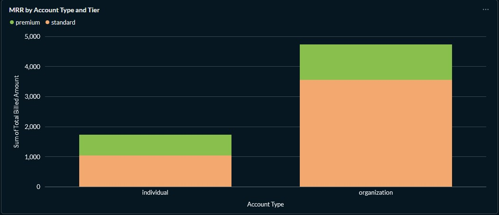
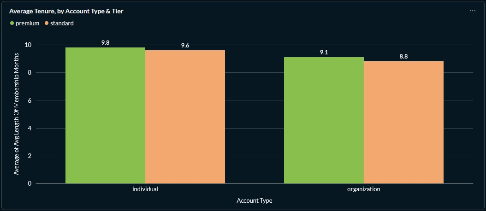
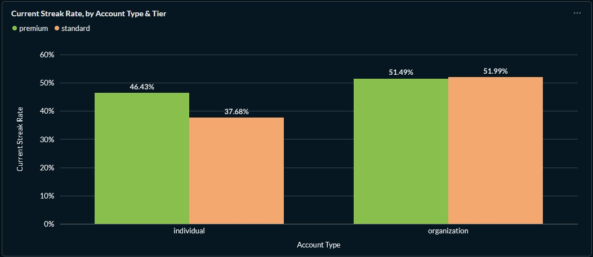
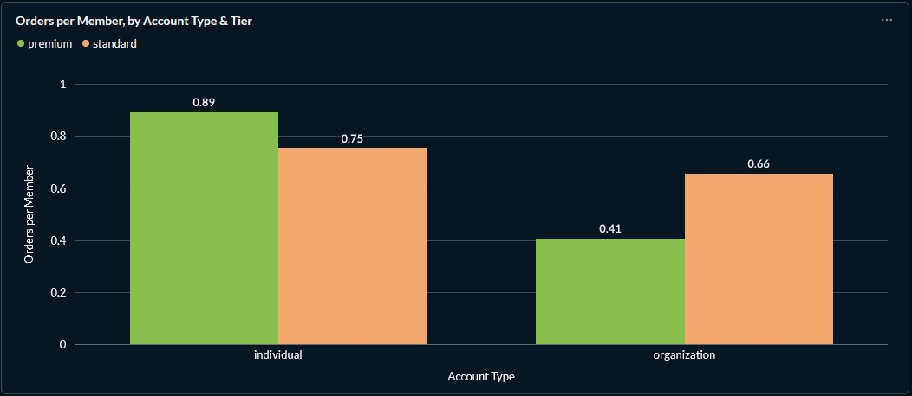

# Employer-Sponsored vs. Self-Pay: Who's More Engaged and More Valuable?

**Company:** APC Wellness — a hybrid B2B2C/D2C fitness and habit-building platform
**Warehouse:** `db_portfolio` (`stg_apc_wellness`, `int_apc_wellness`, `mart_apc_wellness` schemas)
**Stack:** PostgreSQL 18 · dbt Core · Metabase

## The Ask

APC Wellness sells through two fundamentally different channels: through employer/health-plan
sponsorship, and direct self-pay subscriptions. The VP of Product wanted a
straight answer to four questions before deciding where to invest next:

1. **Engagement** - does one segment show up more, by current streak,
   streak length, and longest streak ever?
2. **Value** — which segment generates more revenue, both recurring
   (subscriptions) and one-time (coaching sessions, assessments, event tickets)?
3. **Tenure check** - before trusting either answer above, is one segment
   just *older* than the other? A segment with double the tenure would look
   more engaged and more valuable almost mechanically, independent of any
   real behavioral difference.
4. **Plan tier** - does Standard vs. Premium change the picture within
   each segment?

## Building the Query

This started as an ad-hoc SQL exploration
([`sql/apc_wellness/engagement_and_value.sql`](../../sql/apc_wellness/engagement_and_value.sql)),
written and validated by hand before being promoted into a permanent dbt
mart. A few real bugs surfaced along the way that are worth walking through
explicitly. These are the kind that don't throw an error and don't look wrong at a
glance, but they still quietly produce an incorrect number.

### Anchoring "today" to the Data and not the Clock

The workout data is a static snapshot that is generated only once. Comparing anything
against `current_date` means that the answer silently changes (and eventually
breaks) every day that passes without the data being refreshed. Instead,
every "as of now" comparison in this query anchors to the data's own most
recent date:

```sql
as_of_date as (
    select max(activity_date) as as_of_date
    from {{ ref('stg_apc_wellness__workouts') }}
)
```

This is what makes a "currently active streak" a stable, well-defined
concept. In this case, a streak counts as current if it ends exactly
on `as_of_date`, not "today":

```sql
, most_recent_streaks as (
    select
        ms.member_id
        , ms.streak_length_days
        , (ad.as_of_date - ms.streak_end_date) as days_since_streak_end
        , case when (ad.as_of_date - ms.streak_end_date) = 0 then 1 else 0 end as is_current
    from {{ ref('int_apc_wellness__member_streaks') }} as ms
        cross join as_of_date as ad
    where streak_recency_rank = 1
)
```

### Pre-Aggregating Before Joining (Everywhere a T isn't 1:1 with Members)

`orders` and `member_streaks` are both one-to-many with `members`, so a
member can have several orders and several past streaks. Joining either of
those directly into a query that's also summing `subscriptions.billed_amount`
silently fans out every other aggregate in the same row for any member
with more than one order or streak. This multiplies revenue and streak counts
that should never have been duplicated. The fix is the same pattern used
throughout this warehouse's staging layer: collapse to one row per member
*before* it touches the main join, not after:

```sql
, member_orders as (
    select
        member_id
        , count(*) as count_orders
        , sum(amount) as total_orders_amount
    from {{ ref('stg_apc_wellness__orders') }}
    group by 1
)
```

Every join into the final `select` -- `member_orders`, `most_recent_streaks`,
`member_longest_streaks` -- is either 1:1 or already pre-aggregated to the
member grain, so nothing downstream can silently duplicate.

### Full query

```sql
with

    as_of_date as (
        select max(activity_date) as as_of_date
        from {{ ref('stg_apc_wellness__workouts') }}
    )

    , member_longest_streaks as (
        select
            member_id
            , max(streak_length_days) as longest_streak
        from {{ ref('int_apc_wellness__member_streaks') }}
        group by 1
    )

    , most_recent_streaks as (
        select
            ms.member_id
            , ms.streak_length_days
            , (ad.as_of_date - ms.streak_end_date) as days_since_streak_end
            , case when (ad.as_of_date - ms.streak_end_date) = 0 then 1 else 0 end as is_current
        from {{ ref('int_apc_wellness__member_streaks') }} as ms
            cross join as_of_date as ad
        where streak_recency_rank = 1
    )

    , member_orders as (
        select
            member_id
            , count(*) as count_orders
            , sum(amount) as total_orders_amount
        from {{ ref('stg_apc_wellness__orders') }}
        group by 1
    )

select
    a.account_type
    , p.tier
    , count(distinct m.member_id) as count_members
    , sum(s.billed_amount) as total_billed_amount
    , round((sum(s.billed_amount) / count(distinct m.member_id)), 2) as rev_per_member

    , count(case when mrs.is_current = 1 then m.member_id end) as count_mem_with_current_streak
    , round(avg(case when mrs.is_current = 1 then mrs.streak_length_days end), 1) as avg_current_streak_length
    , round(avg(mls.longest_streak), 1) as avg_longest_streak_days

    , sum(mo.count_orders) as count_orders -- these are one-time purchases instead of subscriptions

    , round(avg(aod.as_of_date - m.join_date), 1) as avg_length_of_membership_days
    , round(avg(aod.as_of_date - m.join_date) / 30, 1) as avg_length_of_membership_months
from {{ ref('stg_apc_wellness__members') }} as m
    cross join as_of_date as aod
    left join {{ ref('stg_apc_wellness__accounts') }} as a
        on m.account_id = a.account_id
    join {{ ref('stg_apc_wellness__subscriptions') }} as s
        on m.member_id = s.member_id
    join {{ ref('stg_apc_wellness__plans') }} as p
        on s.plan_id = p.plan_id
    left join member_orders as mo
        on m.member_id = mo.member_id
    left join most_recent_streaks as mrs
        on m.member_id = mrs.member_id
    left join member_longest_streaks as mls
        on m.member_id = mls.member_id
group by 1, 2
```

This was promoted (unchanged) into
[`mart_apc_wellness__engagement_by_segment`](../../dbt/models/marts/apc_wellness/mart_apc_wellness__engagement_by_segment.sql),
with `not_null`/`accepted_values` tests on `account_type` and `tier`, both
passing, and the mart's output verified row-for-row identical to this
query before being trusted as the dashboard's source.

## Results



| Segment | Members | Total MRR | Rev/Member | % w/ Current Streak | Avg Current Streak | Avg Longest Streak | Orders/Member | Avg Tenure |
|---|---|---|---|---|---|---|---|---|
| Individual · Premium | 28 | $699.72 | $24.99 | 46% | 2.0 days | 5.0 days | 0.89 | 9.8 mo |
| Individual · Standard | 69 | $1,034.31 | $14.99 | 38% | 1.9 days | 5.4 days | 0.75 | 9.6 mo |
| Organization · Premium | 101 | $1,173.36 | $11.62 | 51% | 2.2 days | 5.3 days | 0.41 | 9.1 mo |
| Organization · Standard | 302 | $3,552.01 | $11.76 | 52% | 2.0 days | 5.2 days | 0.66 | 8.8 mo |

**Tenure Check**

- All four segments average 8.8–9.8 months — a
few weeks' spread, not a multiple. Whatever differences appear below
aren't explained away by one segment simply having more time to
accumulate activity or spend.



**Engagement Favors Organization-Sponsored Members**
- This is happening despite averaging *slightly less* tenure, not more: 51–52% currently active vs. 38–46% for
self-pay.
- Streak length itself (both current and historical) is flat across every segment (~2.0 and ~5.2 days respectively), so the
differentiator is *participation*, and not intensity.
- This runs against the intuitive "people try harder when it's their own money" story, and fits
better with reduced signup friction and a possible cohort/social effect from being enrolled alongside coworkers.



**Value Splits Two Ways instead of One**
- Self-pay members generate more *per member* ($14.99–$24.99 vs. $11.62–$11.76) and buy more one-time
add-ons per person (0.75–0.89 vs. 0.41–0.66 orders/member).
- This is consistent with a self-selected, already-committed buyer.
- But organizations dominate *total* MRR ($4,725 vs. $1,734) purely on volume (403 members vs. 97).



**One Number Looks Like a Bug but Is Not:**
- Organization-Premium bills almost identically to organization-Standard ($11.62 vs. $11.76).
- This is correct and is not an error since an employer's per-member rate is negotiated at the account/contract level, independent of which plan tier
an individual member happens to select.

## Recommendation

- This is not a single-direction answer, and forcing one would be less honest than
the data support.
- Employer-sponsored is the **volume and engagement** play with more total revenue, meaningfully better current participation.
- Self-pay is the **per-head value** play — higher revenue and higher purchase rate per individual. 
- The right move depends on which lever the business actually needs right now: total revenue growth points toward
employer partnerships; margin-per-user and upsell potential points toward
self-pay acquisition.
- It could be worth revisiting once cancellations exist in the data (they don't yet — every subscription in this warehouse is currently
`status = 'active'`), since a real retention comparison would meaningfully sharpen this recommendation.