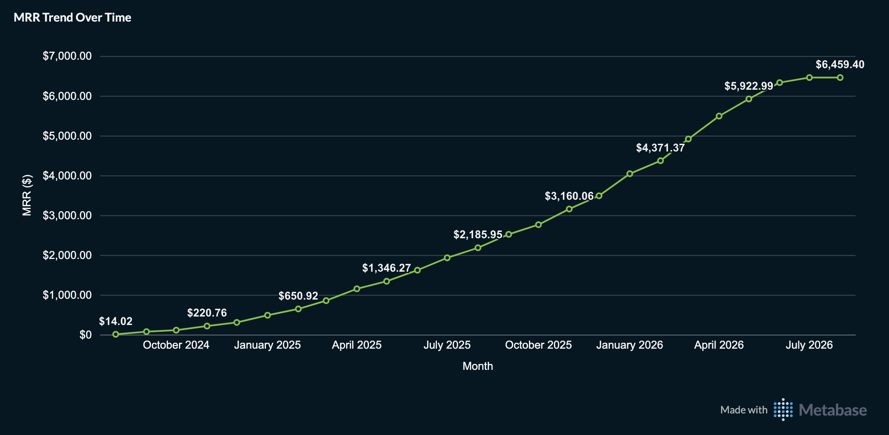
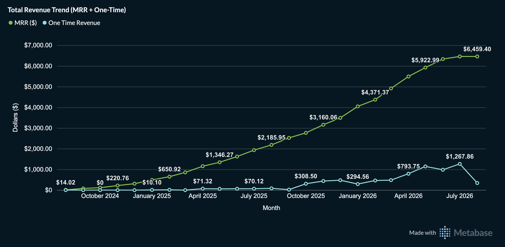
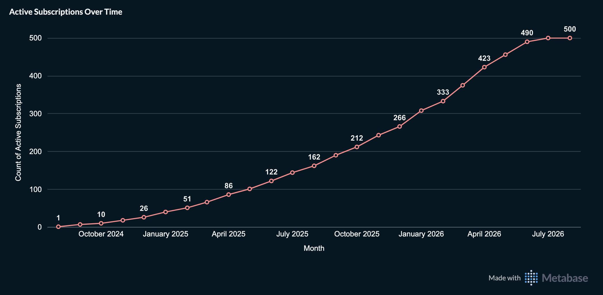
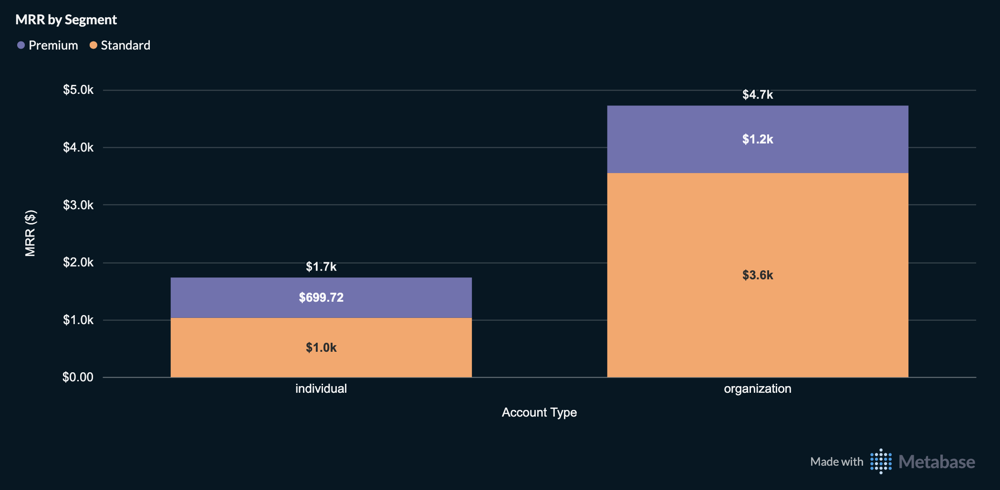
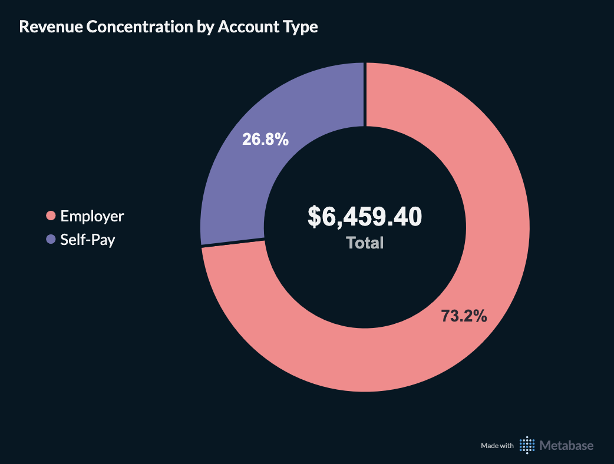
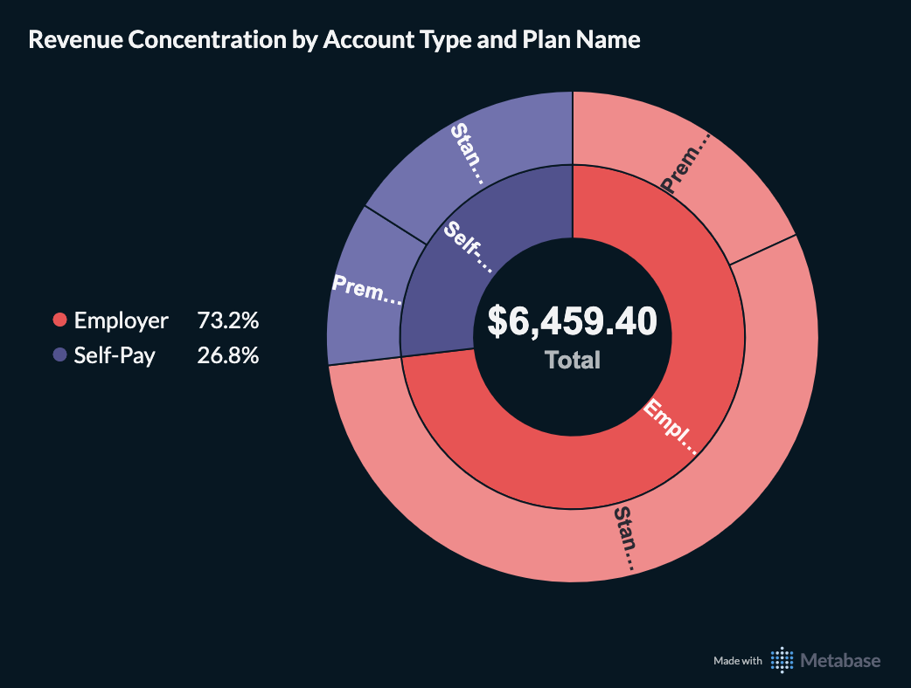

# Revenue Trend and Segment Mix

Company: APC Wellness — a hybrid B2B2C/D2C fitness and habit-building platform
Warehouse: `db_portfolio` (`int_apc_wellness`, `mart_apc_wellness` schemas)
Stack: PostgreSQL 18 · dbt Core · Metabase

## The Ask

Ahead of a board update, the CFO wanted a clear picture of revenue health:

1. Trend - How has MRR grown month over month? What's the split
   between recurring subscription revenue and one-time purchase revenue?
2. Growth rate - Is growth accelerating, flat, or slowing down?
3. Segment mix - Of current active MRR, how much comes from
   employer-sponsored versus self-pay? How does that split further by
   plan tier?
4. Concentration risk - Is revenue overly concentrated in one
   segment? How exposed would the business be to losing a major
   employer contract?

## Building the Analysis

Unlike the first two case studies, this one didn't need to start with a new
ad-hoc query. Two mart models already existed from the Finance domain build -
[`mart_apc_wellness__revenue_trend`](../../../../dbt/models/marts/apc_wellness/mart_apc_wellness__revenue_trend.sql)
(monthly MRR, one-time revenue, and active subscription counts) and
[`mart_apc_wellness__revenue_by_segment`](../../../../dbt/models/marts/apc_wellness/mart_apc_wellness__revenue_by_segment.sql)
(MRR by account type and plan tier). Between them, every part of
the brief was already answerable. Writing a new query here would have
meant re-deriving logic that already existed and was already tested.

## Results

### Trend

MRR has grown from $14.02 in the company's first month to $6,459.40
currently. This is a sustained upward trend across the company's full
history, and not just a recent spike.

Splitting recurring from one-time revenue makes the relative scale a bit more clear:
one-time purchase revenue is a small fraction of total revenue
throughout, peaking around $1,267.86 in a single month against MRR in
the thousands. Therefore, subscriptions (not one-time purchases) are what actually
drives this business's revenue.

### Growth Rate

Active subscriptions grew from 1 to 500 members.
- In the interest of transparency about what's actually driving the shape of this curve, and not just its direction:
growth visibly flattens in the final month or two (423 → 490 → 500).
- This is not organic market saturation. The synthetic member population was
generated with a hard cap of exactly 500 members by design, so the
curve flattens once it reaches that ceiling.
- More broadly, member `join_date`s were generated with a distribution weighted toward
more recent joins, which means the apparent "acceleration" in both
subscriber count and MRR earlier in the trend is partly a direct
consequence of how the data was constructed, rather than something that should
be read as a real go-to-market inflection point.
- The trend is real and the numbers are consistent, but the specific shape of the curve
reflects the warehouse's data generation, and not organic business dynamics.

One additional pattern worth a note: one-time revenue peaks around $1,267.86
before dropping sharply in the most recent month. This could reflect a real recent slowdown,
but given how much of this trend's overall shape already traces back to data-generation
artifacts, it's treated here as inconclusive rather than an actual
finding.

### Segment Mix

Employer-sponsored accounts generate $4.7k MRR (Standard $3.6k +
Premium $1.2k) against individual self-pay's $1.7k (Standard ~$1.0k +
Premium $699.72)
- This matches the same account-level pattern the
[engagement case study](../engagement_by_segment/engagement_by_segment.md)
found: employer-sponsored dominates on volume, self-pay generates more
per member.

### Concentration Risk

73.2% of total MRR comes from employer-sponsored accounts, 26.8% from
self-pay. This shows us a meaningful concentration in one channel. The nested
view adds the plan-tier breakdown within each: Standard dominates both
segments (76.6% of employer MRR, 58.8% of self-pay MRR), with Premium as
the minority tier in both.

A real limitation of the findings is regarding the
CFO's question specifically about exposure to losing a single major
employer contract.
- This mart can't answer that question precisely:
  - 73.2% is spread across 12 separate employer accounts of varying size, not
  concentrated in one relationship, so the true single-contract exposure is
  meaningfully smaller than 73.2%
  - Exactly how much smaller would require a per-account MRR breakdown that doesn't exist yet.

## Recommendation

Revenue is genuinely growing and the subscription base is real and
substantial.

1. The 73.2% employer concentration is significant and worth monitoring, even
   though it's spread across 12 accounts rather than one. A true
   per-employer exposure analysis (which single contracts represent the
   largest share of that 73.2%) is a natural next step that is not
   available in the current data model, but straightforward enough to build.
2. The recent flattening in subscriber growth is a data artifact, not
   a market signal. This data warehouse's synthetic member population was
   generated with a fixed 500-member cap, so naturally growth will stop once
   it's reached.