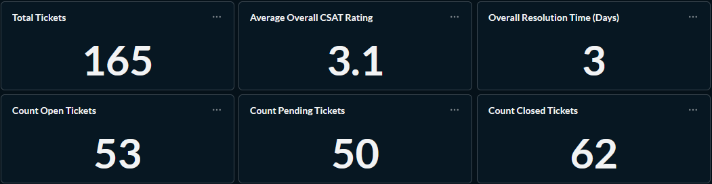
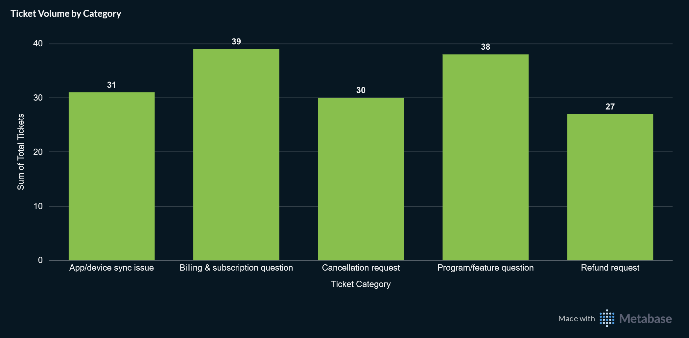
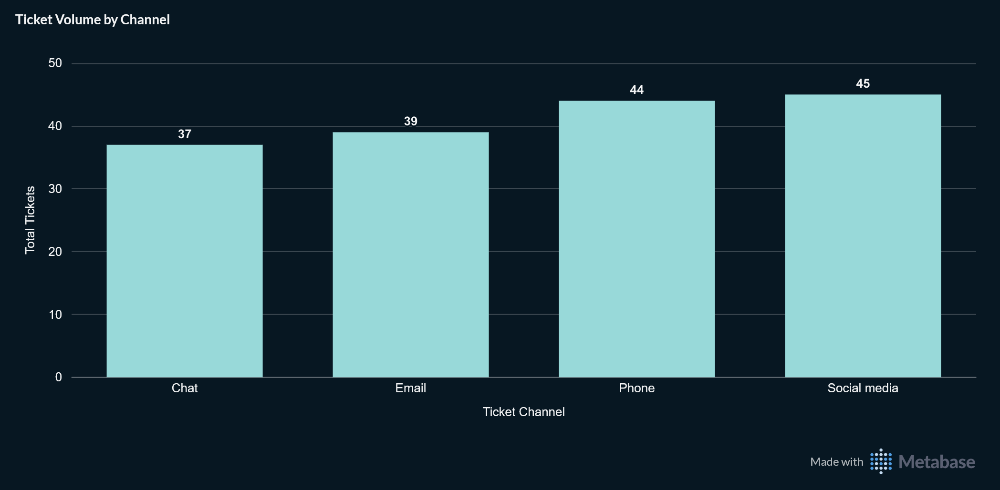
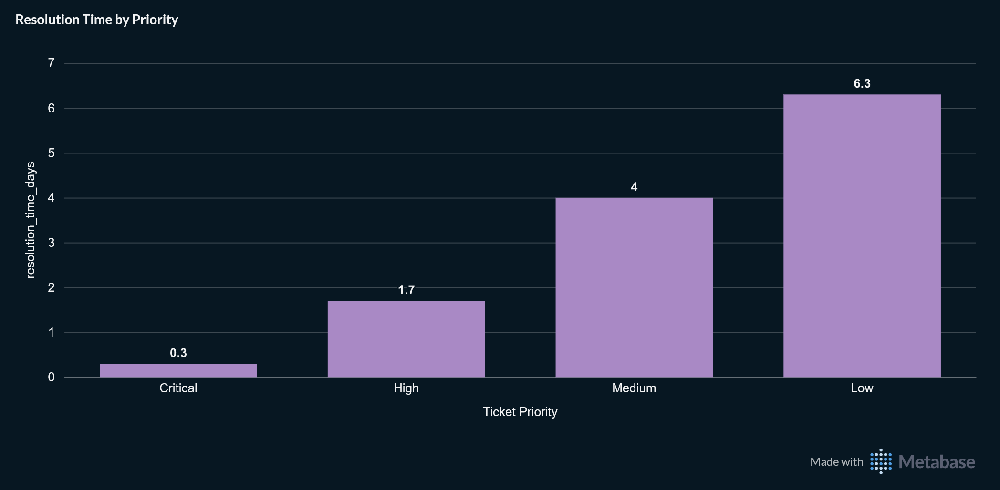
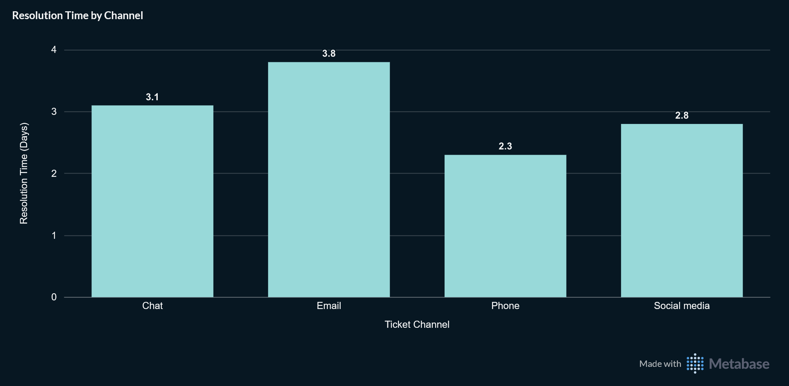
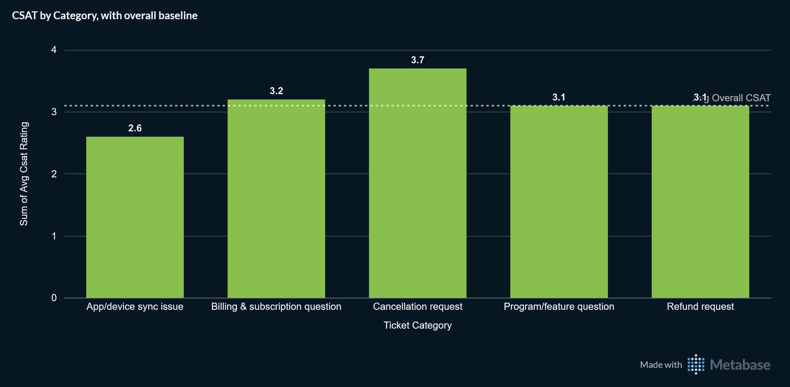
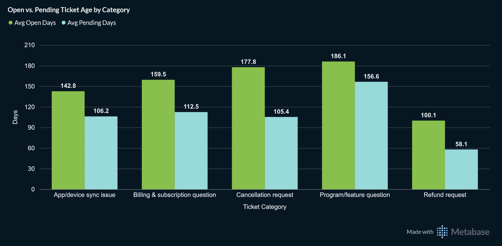
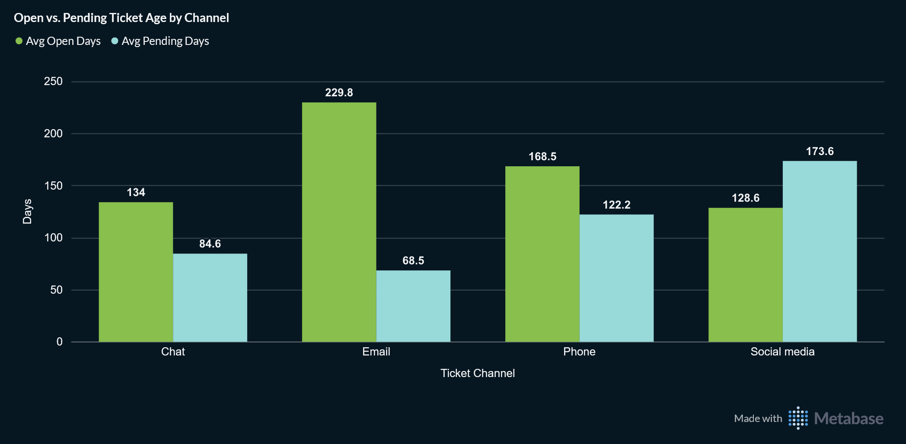

# What's Driving Support Volume, and How Fast Do We Resolve It?

Company: APC Wellness — a hybrid B2B2C/D2C fitness and habit-building platform
Warehouse: `db_portfolio` (`stg_apc_wellness`, `mart_apc_wellness` schemas)
Stack: PostgreSQL 18 · dbt Core · Metabase

## The Ask

The Head of Customer Support wanted a clear picture of what's actually
driving support load and how well it's being handled:

1. Volume — Which categories generate the most tickets?
2. Speed — How fast are tickets resolved overall, and does that vary
   by category or priority? Critical/high priority is expected to
   resolve faster than low priority. This is worth confirming that's actually true, and not just assumed.
3. Channel — Which channels get used most, and is there a meaningful
   difference in resolution speed or satisfaction by channel?
4. Satisfaction — What's the average CSAT, overall and by category?
5. Backlog health — How many tickets are currently open or pending,
   and how old is that backlog?

## Building the Query

Unlike the [engagement case study](engagement_by_segment.md), this one
doesn't reduce to a single query. Volume-by-category, speed-by-priority,
channel comparisons, and whole-portfolio numbers are four different grains.
Forcing them into one `group by` means answering "which category drives the most volume"
by mentally re-summing across every priority/channel combination in a giant cross-tab.
Four focused outputs beat one that requires that kind of manual reconstruction.

### Anchoring to the data's own most recent point — again, but with a real subtlety

The same principle as the engagement case study: never compare against
`current_date`, since the ticket data is a static snapshot that drifts
further from "now" every day that it isn't regenerated. The first attempt at
an anchor here used `max(resolved_at)` instead of `current_date`, which is an
improvement, but still wrong, for the following reason:
- `resolved_at` is only populated for tickets that have actually been resolved, and even
then it lags behind `created_at` by however long that resolution took.
- Using it as the "as of" reference systematically *understates* how old
open tickets actually are, and it completely ignores every ticket created
very recently that hasn't been resolved yet, which is exactly the opposite of
what a backlog-age calculation needs to be conservative about.
- `created_at` is populated for every ticket regardless of status, so its maximum is the
correct anchor:

```sql
as_of_date as (
    select max(created_at) as as_of_date
    from {{ ref('stg_apc_wellness__support_tickets') }}
)
```

### Splitting "open" into two different states

An early pass treated any ticket without a `resolved_at` timestamp as
uniformly "open." The actual status field has three values, however: `Open`,
`Pending Customer Response`, and `Closed`.
The first two mean different things:
- `Open` is untouched and waiting on support, while
- `Pending Customer Response` means support has already replied and is
waiting on the *customer*.

Blending them into one "open" bucket would  hide exactly the distinction a backlog-health question needs.
This was fixed by keying directly off `ticket_status` instead of inferring state from a null check:

```sql
, count(case when st.ticket_status = 'Open' then st.ticket_id end) as count_open
, round(avg(case when st.ticket_status = 'Open' then ad.as_of_date - st.created_at end), 1) as avg_open_days
, count(case when st.ticket_status = 'Pending Customer Response' then st.ticket_id end) as count_pending
, round(avg(case when st.ticket_status = 'Pending Customer Response' then ad.as_of_date - st.created_at end), 1) as avg_pending_days
, count(case when st.ticket_status = 'Closed' then st.ticket_id end) as count_closed
```

### The Four Queries

Written and validated ad-hoc first
([`sql/apc_wellness/support_volume_and_resolution.sql`](../../../../sql/apc_wellness/support_volume_and_resolution.sql)),
as one `with` block containing four independent CTEs:
- `overall_metrics`
- `category_metrics`
- `priority_metrics`
- `channel_metrics`

Each one was checked individually before being trusted.
All four share the same structure, differing only in the `group by` column:

```sql
with

    as_of_date as (
        select max(created_at) as as_of_date
        from {{ ref('stg_apc_wellness__support_tickets') }}
    )

select
    st.ticket_category
    , o.avg_overall_csat_rating
    , count(st.ticket_id) as total_tickets
    , round(avg(st.csat_rating), 1) as avg_csat_rating
    , round(avg(st.resolved_at - st.created_at), 1) as resolution_time_days
    , count(case when st.ticket_status = 'Open' then st.ticket_id end) as count_open
    , round(avg(case when st.ticket_status = 'Open' then ad.as_of_date - st.created_at end), 1) as avg_open_days
    , count(case when st.ticket_status = 'Pending Customer Response' then st.ticket_id end) as count_pending
    , round(avg(case when st.ticket_status = 'Pending Customer Response' then ad.as_of_date - st.created_at end), 1) as avg_pending_days
    , count(case when st.ticket_status = 'Closed' then st.ticket_id end) as count_closed
from {{ ref('stg_apc_wellness__support_tickets') }} as st
    cross join overall as o
    cross join as_of_date as ad
group by 1, 2
order by 2 desc
```

Promoted into four separate marts:
- [`tickets_overall`](../../../../dbt/models/marts/apc_wellness/mart_apc_wellness__tickets_overall.sql)
- [`tickets_by_category`](../../../../dbt/models/marts/apc_wellness/mart_apc_wellness__tickets_by_category.sql)
- [`tickets_by_priority`](../../../../dbt/models/marts/apc_wellness/mart_apc_wellness__tickets_by_priority.sql)
- [`tickets_by_channel`](../../../../dbt/models/marts/apc_wellness/mart_apc_wellness__tickets_by_channel.sql)

These all contain one improvement that the ad-hoc version couldn't achieve: the three
dimension marts `ref()` the `tickets_overall` mart directly to get
`avg_overall_csat_rating`, rather than each independently recomputing the
same whole-portfolio aggregate from raw staging data three separate
times.

All 69 tests across the warehouse pass, including `unique`/`not_null`
on each mart's dimension column and `accepted_values` on `ticket_priority`
and `ticket_channel`.

## Results



165 total tickets. 62 closed, 53 open, 50 pending customer response.
Average CSAT 3.1/5. Average resolution time (for closed tickets) 3 days.

### Volume




The volume is fairly evenly spread across all five categories (27–39 tickets
each) and all four channels (37–45 each), and no single category or channel
dominates ticket volume the way the brief's framing ("is it mostly
billing confusion?") anticipated.

### Speed — the brief's assumption, confirmed



Resolution time by priority is genuinely monotonic: Critical (0.3 days)
< High (1.7) < Medium (4.0) < Low (6.3). The brief's expectation held up
under an actual check, and it is not just an assumption left untested.



Channel tells a different, but more operationally interesting story: Phone
resolves fastest (2.3 days), followed by Social media (2.8) and Chat
(3.1), with Email as the slowest (3.8 days).

This is a real, albeit modest, spread
worth knowing when routing tickets.

### Satisfaction



Against the 3.1 overall baseline, Cancellation request (3.7) and
Program/feature question (3.1) sit at or above baseline, while
App/device sync issue (2.6) is the clear underperformer as the one category
meaningfully dragging the average down.

### Backlog health — where "open" and "pending" tell different stories




| Category | Open (count / avg days) | Pending (count / avg days) |
|---|---|---|
| App/device sync issue | 12 / 142.8 | 9 / ~106 |
| Billing & subscription question | 8 / 159.5 | 11 / ~112 |
| Cancellation request | 12 / 177.8 | 9 / ~105 |
| Program/feature question | 14 / 186.1 | 14 / ~156 |
| Refund request | 7 / 100.1 | 7 / ~58 |

| Channel | Open (count / avg days) | Pending (count / avg days) |
|---|---|---|
| Chat | 12 / 134.0 | 9 / 84.6 |
| Email | 9 / 229.8 | 13 / 68.5 |
| Social media | 16 / 128.6 | 13 / 173.6 |
| Phone | 16 / 168.5 | 15 / 122.2 |

Overall, `Open` tickets average 159 days old versus 115 days for
`Pending`.
- Untouched tickets are aging noticeably worse than ones
already in progress.
- Two specific numbers stand out as the sharpest
findings in the whole analysis: Email has by far the worst open-ticket
backlog (229.8 days), well above every other channel, and
Program/feature question is the worst category (186.1 days).
- Two cells buck the overall open > pending trend:
  - Critical priority and Social media channel both show pending older than open, but with only
  12–16 tickets in each of those specific cells, this reads as small-sample noise.

## Recommendation

Two concrete, high-confidence actions for the Head of Support:

1. Investigate the Email backlog specifically. At 229.8 days average
   age for open tickets, this is the single worst number anywhere in the
   analysis. It is worth understanding whether it's a staffing/routing issue
   or something structural about how email tickets get triaged.
2. App/device sync issue is the CSAT problem to fix first. It's the
   only category meaningfully below the 3.1 baseline, and at 31 tickets
   it's high-volume enough that improving it would move the overall
   average, not just one category's number.

Priority-based routing is already working as intended since the
resolution-time pattern confirms critical/high tickets genuinely get
handled faster. The bigger opportunity is category- and channel-specific:
volume is evenly distributed, so there's no single dominant driver to fix,
but Email and App/device sync issue are each, independently, the clear
outlier worth addressing first.